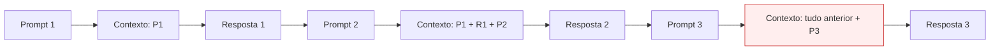
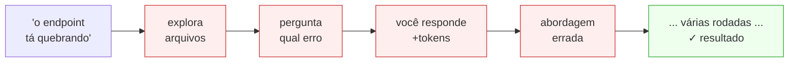
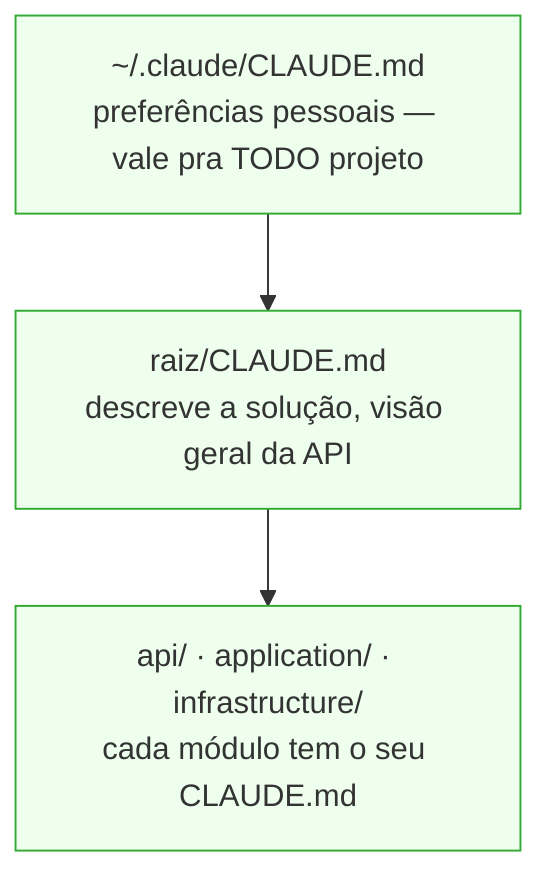

# IA com Eficiência 🧠⚡

Como evitar ficar sem tokens — e usar a IA como engenharia, não como sorte

<div class="pt-12 opacity-70">
  Apresentação para o time · 1h
</div>

<!--
Abertura humilde e prática. A ideia não é "olha como eu sei", e sim:
"todos nós já ficamos sem IA antes do fim do mês — vamos entender por quê e mudar isso juntos".
-->

---
transition: fade-out
---

# O problema

A IA é incrível... até acabar no meio do mês.

<v-clicks>

- Prompts vagos → o agente entra em **loop de descoberta**
- Sem contexto persistente → ele **redescobre o projeto** a cada tarefa
- Sessões enormes → cada turno custa mais que o anterior
- Resultado: **orçamento de tokens estoura** e o time fica na mão

</v-clicks>

<v-click>

> A boa notícia: quase tudo isso é **engenharia**, não sorte. Dá pra resolver.

</v-click>

---
layout: center
class: text-center
---

# Sumário

<div class="text-left max-w-2xl mx-auto leading-relaxed">

1. Como os tokens são gastos de verdade
2. Pilar 1 — Especificar antes (Spec-Driven)
3. Pilar 2 — CLAUDE.md hierárquico
4. Pilar 3 — Skills
5. Higiene de sessão
6. MCPs — poder e tradeoffs
7. Sub-agents — quando valem
8. Roteamento de modelo
9. Playbook do time

</div>

---
layout: section
---

# 1. Como os tokens são gastos de verdade

O modelo mental que destrava todo o resto

---

# O contexto é reenviado a cada turno

A IA não "lembra" — a cada mensagem, **todo o histórico volta** junto.



<v-click>

**Consequência:** uma sessão longa custa cada vez mais por turno. Conversa de 2h ≠ 2× uma de 1h — é bem mais.

</v-click>

---

# O "imposto da redescoberta"

Sem contexto persistente, o agente **paga pedágio** toda vez que toca no projeto:

<div class="grid grid-cols-2 gap-8 pt-4">

<div>

### ❌ Sem CLAUDE.md
- `grep` na estrutura
- lê 5 arquivos pra "se localizar"
- deduz convenções do zero
- **...a cada tarefa**

</div>

<div v-click>

### ✅ Com CLAUDE.md
- já sabe o que é o projeto
- já sabe onde as coisas estão
- já conhece as convenções
- **vai direto ao ponto**

</div>

</div>

<v-click>

<div class="pt-6 text-center text-xl">
Esse pedágio, multiplicado por cada dev × cada tarefa × cada dia = o estouro do mês.
</div>

</v-click>

---
layout: section
---

# 2. Pilar 1 — Especificar antes

Spec-Driven: a maior alavanca de ROI

---

# O custo de um prompt vago

Sem contexto, o agente **descobre o que você quer** antes de fazer qualquer coisa.



<v-click>

Cada caixa vermelha = tokens que não precisavam existir.

</v-click>

---

# Galeria — Exemplo 1: corrigir um bug

<div class="grid grid-cols-2 gap-6 pt-2">

<div class="border border-red-400 rounded-lg p-4">

### ❌ Antes

```
o endpoint de transferência tá dando erro
```

<div class="pt-2 text-sm opacity-80">

→ O agente explora o projeto, pede o stack trace,
tenta duas abordagens. Gasta ~3× mais tokens.

</div>

</div>

<div v-click class="border border-green-500 rounded-lg p-4">

### ✅ Depois

```
POST /api/v2/transferencias retorna 500
quando valorCentavos = 0.

Stack trace em handler.ts:47.
Esperado: 422 com mensagem de validação.
Não altere a camada de repositório.
```

<div class="pt-2 text-sm opacity-80">

→ Vai direto ao ponto. Uma ida, um fix.

</div>

</div>

</div>

---

# Galeria — Exemplo 2: nova feature

<div class="grid grid-cols-2 gap-6 pt-2">

<div class="border border-red-400 rounded-lg p-4">

### ❌ Antes

```
adiciona paginação na listagem de transações
```

<div class="pt-2 text-sm opacity-80">

→ O agente inventa o estilo de paginação.
Você corrige. Ele refaz. 2–3 rodadas desnecessárias.

</div>

</div>

<div v-click class="border border-green-500 rounded-lg p-4">

### ✅ Depois

```
Adiciona paginação cursor-based em
GET /api/v2/transacoes.

Parâmetros: cursor (string, opcional),
pageSize (int, default 20, max 100).
nextCursor: null quando sem mais páginas.

Segue o padrão de /api/v2/extratos.
Não altere o schema do banco.
```

<div class="pt-2 text-sm opacity-80">

→ Sai certo na primeira tentativa.

</div>

</div>

</div>

---

# Galeria — Exemplo 3: revisão de código

<div class="grid grid-cols-2 gap-6 pt-2">

<div class="border border-red-400 rounded-lg p-4">

### ❌ Antes

```
revisa meu PR
```

<div class="pt-2 text-sm opacity-80">

→ O agente revisa tudo — estilo, imports, nomes
de variável, lógica. Ruído e tokens gastos em
coisas que você não ligava.

</div>

</div>

<div v-click class="border border-green-500 rounded-lg p-4">

### ✅ Depois

```
Revisa src/services/pagamento.ts focando em:
1. race conditions no updateSaldo
2. se os retries respeitam idempotência
3. se logs expõem dados PII

Não revise estilo.
```

<div class="pt-2 text-sm opacity-80">

→ Só o que importa. Resposta útil, curta, barata.

</div>

</div>

</div>

---

# Anatomia de um bom prompt

Quatro ingredientes que eliminam o loop de descoberta:

<v-clicks>

- **Contexto** — qual arquivo, endpoint ou serviço está em jogo
- **Tarefa** — verbo de ação claro: *corrija*, *adicione*, *revise*, *explique*
- **Comportamento esperado** — o que o resultado deve ser (ou como validar)
- **Restrições** — o que **não** tocar

</v-clicks>

<v-click>

<div class="pt-6 mt-4 border-t border-gray-300">

> Você não precisa escrever um ensaio. Quatro linhas com esses quatro pontos já evitam a maioria dos loops.

</div>

</v-click>

---
layout: center
class: text-center
---

# Regra de ouro do Spec-Driven

<div class="text-3xl font-bold pt-8 pb-6 leading-snug">
Se você não consegue descrever o resultado esperado,<br/>o agente também não vai conseguir.
</div>

<v-click>

<div class="text-xl opacity-80 pt-4">
Especifique primeiro. Execute depois.<br/>
Essa ordem salva tokens, tempo e sanidade.
</div>

</v-click>

---
layout: section
---

# 3. Pilar 2 — CLAUDE.md hierárquico

O agente já chega sabendo onde as coisas estão

---

# O mapa que o agente lê antes de começar

Um arquivo Markdown que o Claude carrega **automaticamente** no início da sessão. É a memória persistente do projeto — escrita uma vez, lida sempre.

<v-clicks>

- O que o projeto **é** (domínio, arquitetura em uma frase)
- **Onde** as coisas estão (estrutura, pastas que importam)
- **Como** se faz aqui (convenções, comandos de build/test, regras de "não faça")

</v-clicks>

<v-click>

<div class="pt-6 text-center text-xl">

Sem isso, cada tarefa começa do zero (o pedágio do bloco anterior). Com isso, começa do mapa.

</div>

</v-click>

---

# Camadas: do geral ao específico



<v-click>

<div class="pt-4 text-center text-xl">

O arquivo **mais próximo** do que você está editando vence / complementa.<br/>
Trabalhando em `infrastructure/`? O Claude puxa o CLAUDE.md de lá junto com o da raiz.

</div>

</v-click>

<!-- EXEMPLO REAL: substituir api/application/infrastructure pela estrutura real da solução do banco, e mostrar 2–3 linhas verdadeiras do CLAUDE.md da raiz — só o cabeçalho que descreve o que a API faz. -->

---

# O que escrever onde

<div class="grid grid-cols-2 gap-8 pt-4">

<div>

### Raiz da solução

- Esta API faz X. Stack: Y.
- Build: `cmd`. Test: `cmd`
- Padrão de branch/commit
- Onde **não** mexer

</div>

<div>

### Subprojeto (api / application / infra)

- Convenções locais da camada
- Padrões específicos
- Gotchas ("repositório usa Dapper, não EF")

</div>

</div>

<!-- EXEMPLO REAL: trocar pelos comandos e convenções reais — o comando de build do banco, o padrão de nomenclatura que o time usa. -->

---

# Rico o bastante, enxuto o bastante

<div class="grid grid-cols-2 gap-6 pt-2">

<div class="border border-red-400 rounded-lg p-4">

### ❌ CLAUDE.md gigante

- Despeja o README inteiro
- Histórico, decisões antigas, tudo
- **Imposto invertido:** paga esse contexto em toda sessão, de todo dev

</div>

<div v-click class="border border-green-500 rounded-lg p-4">

### ✅ CLAUDE.md de alto sinal

- Bullets curtos, comandos
- Ponteiros: "detalhes de auth em `docs/auth.md`"
- O agente sabe onde buscar, sem carregar tudo sempre

</div>

</div>

<v-click>

<div class="pt-6 text-center text-xl">

O CLAUDE.md é imposto fixo: cobrado em toda sessão.<br/>Mantenha-o como um **índice**, não como uma enciclopédia.

</div>

</v-click>

---

# Começar é barato

<v-clicks>

- Rode `/init` — o Claude gera um rascunho lendo o projeto
- Edite: corte o ruído, adicione os comandos e as 3–4 regras de "não faça"
- Commite junto com o código — é contexto **compartilhado pelo time** (todo dev se beneficia)
- Refine quando notar o agente "redescobrindo" algo: aquilo virou linha no CLAUDE.md

</v-clicks>

<v-click>

<div class="pt-6 text-center text-xl">

Cada redescoberta que você vê é um candidato a virar uma linha aqui.

</div>

</v-click>

---
layout: section
---

# 4. Pilar 3 — Skills

Procedimentos que só pesam quando você usa

---

# Um procedimento que o agente carrega sob demanda

Uma pasta com um `SKILL.md` (nome + descrição + instruções) e, opcionalmente, scripts. O Claude lê a descrição, decide se é relevante, e só então carrega o conteúdo completo.

<v-clicks>

- Exemplos: "fazer deploy", "gerar uma migration", "rodar o checklist de PR"
- O agente **escolhe sozinho** quando usar, pela descrição
- Pode embutir scripts → trabalho determinístico sai dos tokens e vira código executado

</v-clicks>

---

# Por que Skills são baratas

<div class="grid grid-cols-2 gap-8 pt-4">

<div>

### Em repouso

Só o **nome + descrição** da skill estão no contexto — poucos tokens

</div>

<div>

### Quando acionada

Aí sim o SKILL.md inteiro entra no contexto

</div>

</div>

<v-click>

<div class="pt-6 text-center text-xl">

Você pode ter 20 skills e pagar quase nada por elas até precisar de uma.<br/>Compare com colar o procedimento inteiro no CLAUDE.md — que pesaria sempre.

</div>

</v-click>

---

# Quando vira Skill, quando fica no CLAUDE.md

<div class="grid grid-cols-2 gap-8 pt-4">

<div>

### CLAUDE.md

Fato sempre-relevante do projeto: o que é, onde está, convenção geral

</div>

<div>

### Skill

Procedimento ocasional, com passo a passo: deploy, scaffold, checklist

</div>

</div>

<v-click>

<div class="pt-6 text-center text-xl">

Se você consultaria **toda tarefa** → CLAUDE.md.<br/>Se é um **roteiro que você segue de vez em quando** → Skill.

</div>

</v-click>

<!-- EXEMPLO REAL: citar 1 procedimento real do time que seria uma boa skill — ex.: o passo a passo de criar um novo endpoint seguindo o padrão da casa, ou o checklist de deploy. -->

---
layout: section
---

# 5. Higiene de sessão

Vitórias de eficiência que não custam nada

---

# Uma tarefa, uma sessão

Cada turno reenvia todo o histórico. Arrastar a tarefa B dentro da sessão cheia da tarefa A faz a B pagar pelo contexto da A.

<v-clicks>

- Terminou a tarefa? `/clear` antes de começar outra **não relacionada**
- Contexto limpo = turnos baratos de novo (a curva reseta)
- Regra: trocou de assunto, `/clear`

</v-clicks>

<v-click>

<div class="pt-6 text-center text-xl">

É o hábito de maior ROI por ser literalmente um comando.

</div>

</v-click>

---

# Planeje antes de deixar editar

No plan mode o agente **explora e propõe** um plano sem tocar no código. Você aprova, aí ele executa.

<div class="grid grid-cols-2 gap-8 pt-4">

<div>

### ❌ Sem plano

Ele tenta, erra a abordagem, refaz → tokens gastos em caminho errado

</div>

<div v-click>

### ✅ Com plano

Você corrige a **direção** antes de qualquer edição — barato

</div>

</div>

<!-- EXEMPLO REAL (opcional): se o time tem um caso onde o agente saiu codando a coisa errada, esse é o slide pra mencionar de leve. -->

---

# Quando a sessão precisa continuar longa

`/compact` resume a conversa e segue em frente, em vez de só inflar. O Claude Code também compacta sozinho perto do limite.

<v-click>

<div class="pt-6 text-center text-xl">

`/clear` é o hábito; plan mode é o freio; compactação é o seguro.<br/>**Três comandos, zero custo.**

</div>

</v-click>

---
layout: section
---

# 6. MCPs — poder e tradeoffs

Conectar o agente ao mundo — com consciência do custo

---

# O agente conectado a ferramentas de verdade

MCP (Model Context Protocol) liga o Claude a sistemas externos — GitHub, Jira, banco de dados, Sentry — de forma padronizada. Ele deixa de só conversar e passa a **agir** e a **ler dados ao vivo**.

<v-clicks>

- Sem copia-e-cola: o agente lê o ticket, abre o PR, consulta o log
- Padronizado: o mesmo protocolo serve pra vários serviços

</v-clicks>

---

# O imposto que você não vê

Cada servidor MCP injeta as **definições das suas ferramentas (schemas)** no contexto — em **todo turno**, mesmo que você não use nenhuma delas naquela conversa.

<div class="grid grid-cols-2 gap-8 pt-4">

<div>

### 1 MCP habilitado

Schema das ferramentas → X tokens em todo turno

</div>

<div v-click>

### 10 MCPs habilitados

10× schemas → N tokens **antes de você escrever qualquer coisa**

</div>

</div>

<v-click>

<div class="pt-6 text-center text-xl">

Ligar dez MCPs "por garantia" é o mesmo erro do CLAUDE.md gigante:<br/>capacidade que você paga sempre e usa quase nunca.

</div>

</v-click>

---

# Exemplo: navegação web

<div class="grid grid-cols-2 gap-6 pt-2">

<div class="border border-green-500 rounded-lg p-4">

### ✅ Só ler uma página

`WebFetch` — leve, traz o conteúdo e pronto.

Quase zero overhead de schema.

</div>

<div class="border border-red-400 rounded-lg p-4">

### ⚠️ Interagir de verdade

MCP do Playwright — clicar, preencher, screenshot.

Muitas ferramentas, schemas grandes.

</div>

</div>

<v-click>

<div class="pt-6 text-center text-xl">

Use a ferramenta pesada só quando a tarefa pede interação real.<br/>Para ler, o leve resolve.

</div>

</v-click>

---
layout: center
class: text-center
---

# MCPs — a regra

<div class="text-3xl font-bold pt-8 pb-6 leading-snug">

Habilite o MCP que a <strong>tarefa</strong> pede.<br/>Desligue o resto.

</div>

<v-click>

<div class="text-xl opacity-80 pt-4">

Poder sob demanda, não poder por garantia.

</div>

</v-click>

<!-- EXEMPLO REAL: se o time já usa algum MCP (Azure DevOps? Jira? um interno?), citar qual e o ganho concreto que ele trouxe — fica muito mais palpável que o exemplo genérico. -->

---
layout: section
---

# 7. Sub-agents — quando valem

Delegar sem poluir a sessão principal

---

# Um agente com a própria janela de contexto

Você dispara um sub-agente pra uma tarefa; ele trabalha numa janela de contexto **separada** e devolve só o **resultado final** pra sessão principal.

<v-click>

<div class="pt-6 text-center text-xl">

O trabalho sujo dele — buscas, arquivos lidos, tentativas — **não** entope a sua conversa.

</div>

</v-click>

---

# Cold start vs contexto isolado

<div class="grid grid-cols-2 gap-8 pt-4">

<div>

### Custo — cold start

O sub-agente começa do zero. Ele **não** tem o seu histórico — re-descobre o que precisa. Disparar tem overhead.

</div>

<div>

### Ganho — contexto isolado

Todo o ruído intermediário fica na janela dele. A sua sessão principal recebe só a conclusão, limpa.

</div>

</div>

<v-click>

<div class="pt-6 text-center text-xl">

A pergunta é sempre: o overhead de começar do zero compensa manter o ruído fora?

</div>

</v-click>

---

# A régua

<div class="grid grid-cols-2 gap-6 pt-2">

<div class="border border-green-500 rounded-lg p-4">

### ✅ Vale

- Fan-out: várias buscas/tarefas independentes em paralelo
- Tarefa longa e isolada cujo trabalho intermediário você não precisa ver

</div>

<div class="border border-red-400 rounded-lg p-4">

### ❌ Não vale

- Coisinha rápida (um `grep`, ler um arquivo) — o cold start custa mais que o trabalho
- Tarefa que **depende** do contexto da sua conversa (ele não tem)

</div>

</div>

<v-click>

<div class="pt-6 text-center text-xl">

Sub-agent é para isolar trabalho pesado e paralelizável —<br/>não para terceirizar o que você faria em dois cliques.

</div>

</v-click>

---
layout: section
---

# 8. Roteamento de modelo

A maior alavanca de custo do time

---

# Nem toda tarefa precisa do modelo mais caro

Combine o modelo à dificuldade da tarefa. Trivial e bem-especificado → modelo barato. Raciocínio difícil, plano, arquitetura → modelo forte.

<v-clicks>

- **Haiku / Sonnet:** refactor mecânico, boilerplate, tarefa bem-descrita
- **Opus:** planejar, decidir arquitetura, depurar o problema cabeludo

</v-clicks>

---

# O que cada modelo custa

| Modelo | Input (por MTok) | Output (por MTok) |
|---|---|---|
| Haiku 4.5 | $1 | $5 |
| Sonnet 4.6 | $3 | $15 |
| Opus 4.8 | $5 | $25 |

<v-clicks>

- Sonnet ≈ **3× Haiku**
- Opus ≈ **1,67× Sonnet**
- Opus ≈ **5× Haiku**

</v-clicks>

<v-click>

<div class="pt-4 text-center text-xl">

Multiplique isso por cada dev, cada dia.<br/>Trocar o modelo na tarefa certa é a economia mais direta que existe.

</div>

</v-click>

---

# Especifique no forte, execute no barato

<div class="grid grid-cols-2 gap-8 pt-4">

<div>

### Opus — para **pensar**

- O plano
- A spec / arquitetura
- Depurar o problema difícil

</div>

<div>

### Sonnet / Haiku — para **executar**

- O que já está bem-especificado
- Tarefas claras e delimitadas

</div>

</div>

<v-click>

<div class="pt-6 text-center text-xl">

Foi a sua spec clara (bloco 2) e o seu CLAUDE.md (bloco 3) que tornaram seguro<br/>deixar o modelo barato executar.

</div>

</v-click>

<!-- EXEMPLO REAL: se você tem um caso onde planejou no Opus e executou no Sonnet — inclusive esta própria apresentação foi feita assim — vale mencionar como prova viva. -->

---
layout: center
class: text-center
---

# Roteamento — a regra

<div class="text-3xl font-bold pt-8 pb-6 leading-snug">

Se você consegue descrever o resultado,<br/>um modelo barato consegue entregar.

</div>

<v-click>

<div class="text-xl opacity-80 pt-4">

Quando você <strong>não</strong> consegue descrever — é tarefa de Opus.

</div>

</v-click>

---
layout: section
---

# 9. Playbook do time

O essencial num cartão

---

# O cartão de bolso

<v-clicks>

- ✅ **Especifique antes** — contexto, tarefa, resultado esperado, restrições. Se não dá pra descrever, o agente não adivinha.
- ✅ **CLAUDE.md enxuto e em camadas** — o agente já chega sabendo; índice, não enciclopédia.
- ✅ **Skills pro que é procedimento** — carrega só quando usa.
- ✅ **`/clear` entre tarefas, plan mode antes das grandes** — vitórias de graça.
- ✅ **MCP que a tarefa pede, desligue o resto** — cuidado com o schema invisível.
- ✅ **Sub-agent pra fan-out e trabalho isolado** — não pra coisinha rápida.
- ✅ **Especifique no forte, execute no barato** — a maior alavanca de custo.

</v-clicks>

<v-click>

<div class="pt-6 text-center text-xl">

Usar IA como engenharia é isso: contexto certo, modelo certo, sessão limpa. O resto é hábito.

</div>

</v-click>

---
layout: center
class: text-center
---

# Obrigado 🙌

Vamos usar a IA como engenharia — e nunca mais ficar sem tokens no meio do mês.

<div class="pt-8 opacity-70">Perguntas?</div>
