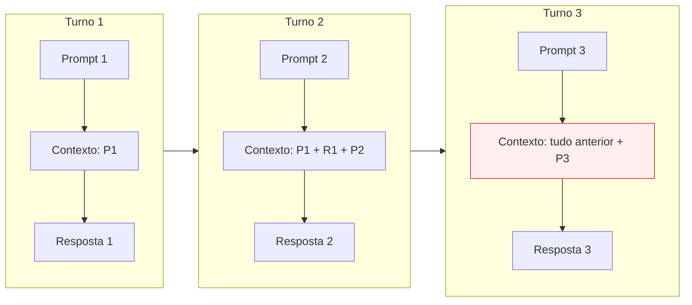

# 1. Como os tokens são gastos de verdade

O contexto é reenviado a cada turno — todo o resto decorre disso

---

# O contexto é reenviado a cada turno

A IA não "lembra" — a cada mensagem, **todo o histórico volta** junto.



<v-click>

**Consequência:** uma sessão longa custa cada vez mais por turno. Conversa de 2h ≠ 2× uma de 1h — é bem mais.

</v-click>

---

# Nem todo token custa igual

O `/usage` separa quatro tipos. Os preços abaixo usam o Sonnet 4.6 como base:

<div class="text-sm">

| Tipo | O que é | Custo | $/MTok |
|---|---|---|---|
| **Cache read** | reler contexto já cacheado | **0,1×** | $0,30 |
| **Input** | tokens novos, 1ª vez | 1× (base) | $3,00 |
| **Cache write** | gravar contexto no cache | 1,25× | $3,75 |
| **Output** | tokens que o modelo **gera** | 5× | $15,00 |

</div>

<v-click>

<div class="pt-4 text-center text-xl">

O cache é o que torna o reenvio do contexto viável: reler custa **1/10**.<br/>
Mas atenção ao volume — numa sessão longa, o cache read relê **tudo, a cada turno**.

</div>

</v-click>

---

# Caso real — esta própria apresentação

Construí estes slides conversando e ajustando com a IA. Muitas iterações na mesma sessão → o `slides.md` crescia e era **relido a cada turno**.

<div class="grid grid-cols-2 gap-6 pt-4">

<div>

### O que apareceu no `/usage`

```
Sonnet 4.6
  input:        8,2k
  output:      24,3k
  cache write: 77,1k
  cache read:   4,6M   ← !
  -----------------------
  custo:       $2,23
```

</div>

<div v-click>

### Para onde foi o dinheiro

```
cache read:  4,6M × $0,30 = $1,38
output:     24,3k × $15    = $0,36
cache write: 77,1k × $3,75 = $0,29
input:        8,2k × $3    = $0,02
```

<div class="pt-2 text-sm opacity-80">

O maior item não foi o output — foi **reler o contexto**, turno após turno.

</div>

</div>

</div>

<v-click>

<div class="pt-4 text-center text-xl">

Cada ajuste de slide custava reler tudo de novo. É o argumento do `/clear` e do contexto enxuto — em números reais.

</div>

</v-click>

---

# O "imposto da redescoberta"

Sem contexto persistente, o agente **paga pedágio** toda vez que toca no projeto:

<div class="grid grid-cols-2 gap-8 pt-4">

<div>

### ❌ Sem CLAUDE.md
- `grep` na estrutura
- lê diversos arquivos pra "se localizar"
- deduz convenções do zero
- **...a cada tarefa**

</div>

<div v-click>

### ✅ Com CLAUDE.md
- já sabe o que é o projeto
- já sabe onde as coisas estão
- já conhece as convenções
- já sabe o que **não pode fazer** no ambiente (ex.: sem `sudo` no devcontainer — não tenta, não entra em loop de erro)
- **vai direto ao ponto**

</div>

</div>

<v-click>

<div class="pt-6 text-center text-xl">
Multiplicado por cada dev, cada tarefa, cada dia: o agente redescobre o mesmo projeto centenas de vezes. Um CLAUDE.md resolve isso uma vez.
</div>

</v-click>
