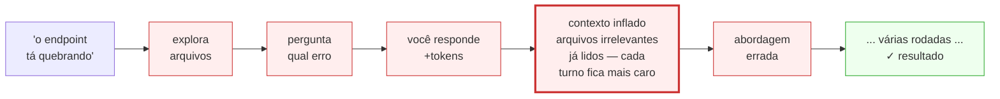

# 2. Pilar 1 — Especificar antes

Spec-Driven: eliminar ambiguidade antes que o agente escreva uma linha

---

# O custo de um prompt vago

Sem contexto, o agente **descobre o que você quer** antes de fazer qualquer coisa.



<v-click>

Cada caixa vermelha = tokens que não precisavam existir.

</v-click>

---

# Galeria — Exemplo 1: corrigir um bug

<div class="grid grid-cols-2 gap-6 pt-2">

<div class="border border-red-400 rounded-lg p-4">

### ❌ Antes

```
o endpoint de transferência está dando erro
```

<div class="pt-2 text-sm opacity-80">

→ O agente explora arquivos, pergunta o que você já sabe,
testa caminhos que poderiam ter sido evitados — tokens gastos desnecessariamente.

</div>

</div>

<div v-click class="border border-green-500 rounded-lg p-4">

### ✅ Depois

```
POST /api/v2/transferencias retorna 500
quando ValorCentavos = 0.

Stack trace em TransferenciaHandler.cs:47.
Esperado: 422 com mensagem de validação.
Não altere a camada de repositório.
```

<div class="pt-2 text-sm opacity-80">

→ Vai direto ao ponto. Uma ida, um fix.

</div>

</div>

</div>

---

# Galeria — Exemplo 2: nova feature

<div class="grid grid-cols-2 gap-6 pt-2">

<div class="border border-red-400 rounded-lg p-4">

### ❌ Antes

```
adiciona paginação na listagem de transações
```

<div class="pt-2 text-sm opacity-80">

→ O agente inventa o estilo de paginação, você corrige,
ele refaz — novamente rodadas de iteração, tool calling, reasoning que poderiam ter sido evitados.

</div>

</div>

<div v-click class="border border-green-500 rounded-lg p-4">

### ✅ Depois

```
Adiciona paginação cursor-based em
GET /api/v2/transacoes.

Parâmetros: cursor (string, opcional),
pageSize (int, default 20, max 100).
nextCursor: null quando não há mais páginas.

Segue o padrão de /api/v2/extratos.
Não altere o schema — sem migrations.
```

<div class="pt-2 text-sm opacity-80">

→ Sai certo na primeira tentativa.

</div>

</div>

</div>

---

# Galeria — Exemplo 3: revisão de código

<div class="grid grid-cols-2 gap-6 pt-2">

<div class="border border-red-400 rounded-lg p-4">

### ❌ Antes

```
revisa meu PR
```

<div class="pt-2 text-sm opacity-80">

→ O agente revisa tudo — estilo, imports, nomes
de variável, lógica. Ruído e tokens gastos em
coisas que você não ligava.

</div>

</div>

<div v-click class="border border-green-500 rounded-lg p-4">

### ✅ Depois

```
Revisa Application/Services/PagamentoService.cs
focando em:
1. race conditions no AtualizarSaldo
2. se os retries respeitam idempotência
3. se logs expõem dados PII

Não revise estilo.
```

<div class="pt-2 text-sm opacity-80">

→ Só o que importa. Resposta útil, curta, barata.

</div>

</div>

</div>

---

# Anatomia de um bom prompt

Quatro ingredientes que eliminam o loop de descoberta:

<v-clicks>

- **Contexto** — qual arquivo, endpoint ou serviço está em jogo
- **Tarefa** — verbo de ação claro: *corrija*, *adicione*, *revise*, *explique*
- **Comportamento esperado** — o que o resultado deve ser (ou como validar)
- **Restrições** — o que **não** tocar

</v-clicks>

<v-click>

<div class="pt-6 mt-4 border-t border-gray-300">

> O que o agente não sabe, ele descobre — e você paga por essa descoberta.

</div>

</v-click>

---
layout: center
class: text-center
---

# Regra de ouro do Spec-Driven

<div class="text-3xl font-bold pt-8 pb-6 leading-snug">
Se você não consegue descrever o resultado esperado,<br/>o agente também não vai conseguir.
</div>

<v-click>

<div class="text-xl opacity-80 pt-4">
Spec clara → agente propõe um plano → você valida → agente executa.<br/>
O custo de ajustar um plano de texto é baixo.<br/>O custo de desfazer uma refatoração que foi na direção errada, não.
</div>

</v-click>
