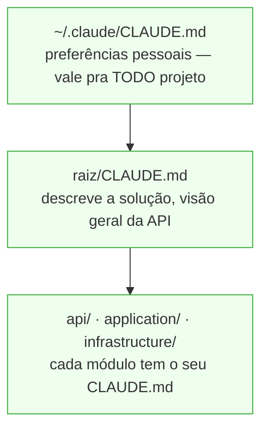

# 3. Pilar 2 — CLAUDE.md hierárquico

O agente já chega sabendo onde as coisas estão

---

# O mapa que o agente lê antes de começar

Um arquivo Markdown que o Claude carrega **automaticamente** no início da sessão. É a memória persistente do projeto — escrita uma vez, lida sempre.

<v-clicks>

- O que o projeto **é** (domínio, arquitetura em uma frase)
- **Onde** as coisas estão (estrutura, pastas que importam)
- **Como** se faz aqui (convenções, comandos de build/test, regras de "não faça")

</v-clicks>

<v-click>

<div class="pt-6 text-center text-xl">

Sem isso, cada tarefa começa do zero (o pedágio do bloco anterior). Com isso, começa do mapa.

</div>

</v-click>

---

# Camadas: do geral ao específico



<v-click>

<div class="pt-4 text-center text-xl">

O arquivo **mais próximo** do que você está editando vence / complementa.<br/>
Trabalhando em `infrastructure/`? O Claude puxa o CLAUDE.md de lá junto com o da raiz.

</div>

</v-click>

<!-- EXEMPLO REAL: substituir api/application/infrastructure pela estrutura real da solução do banco, e mostrar 2–3 linhas verdadeiras do CLAUDE.md da raiz — só o cabeçalho que descreve o que a API faz. -->

---

# O que escrever onde

<div class="grid grid-cols-2 gap-8 pt-4">

<div>

### Raiz da solução

- Esta API faz X. Stack: Y.
- Build: `cmd`. Test: `cmd`
- Padrão de branch/commit
- Onde **não** mexer

</div>

<div>

### Subprojeto (api / application / infra)

- Convenções locais da camada
- Padrões específicos
- Gotchas ("repositório usa Dapper, não EF")

</div>

</div>

<!-- EXEMPLO REAL: trocar pelos comandos e convenções reais — o comando de build do banco, o padrão de nomenclatura que o time usa. -->

---

# CLAUDE.md na prática — exemplo real

Um arquivo construído ao longo de semanas de uso. Os pontos que sobreviveram:

```markdown
# Restrições de ambiente
- Sem acesso `sudo` — não tente instalar dependências globais
- Ambiente: devcontainer (.NET 8, sem acesso à rede externa)

# Convenções que o agente precisa respeitar
- ...

# O que não tocar
- ...

# Onde buscar o quê
- Detalhes de autenticação: docs/auth.md
- Contrato da API: openapi/spec.yaml
```

<v-click>

<div class="pt-4 text-center text-xl">

Cada linha aqui representa uma redescoberta que aconteceu uma vez — e nunca mais vai acontecer.

</div>

</v-click>

<!-- SUBSTITUIR pelo conteúdo real do CLAUDE.md — remover o que for específico do projeto,
     manter estrutura, restrições de ambiente e convenções compartilháveis -->

---

# Rico o bastante, enxuto o bastante

<div class="grid grid-cols-2 gap-6 pt-2">

<div class="border border-red-400 rounded-lg p-4">

### ❌ CLAUDE.md gigante

- Despeja o README inteiro
- Histórico, decisões antigas, tudo
- **Imposto invertido:** paga esse contexto em toda sessão, de todo dev

</div>

<div v-click class="border border-green-500 rounded-lg p-4">

### ✅ CLAUDE.md de alto sinal

- Bullets curtos, comandos
- Ponteiros: "detalhes de auth em `docs/auth.md`"
- O agente sabe onde buscar, sem carregar tudo sempre

</div>

</div>

<v-click>

<div class="pt-6 text-center text-xl">

O CLAUDE.md é imposto fixo: cobrado em toda sessão.<br/>Mantenha-o como um **índice**, não como uma enciclopédia.

</div>

</v-click>

<div class="pt-4 text-xs opacity-60">

Apontar onde buscar em vez de carregar tudo é a mesma ideia por trás do **RAG**: recuperar o trecho certo na hora, não despejar a base inteira no contexto. → <code>anthropic.com/news/contextual-retrieval</code>

</div>

---

# Começar é barato

<v-clicks>

- Rode `/init` — o Claude gera um rascunho lendo o projeto
- Edite: corte o ruído, adicione os comandos, regras de "não faça", limitações."
- Adicione um `.claudeignore` — exclui `dist/`, `node_modules/`, binários e arquivos gerados dos greps; o agente para de explorar o que não tem sentido ler
- Commite os dois junto com o código — é contexto **compartilhado pelo time** (todo dev se beneficia)
- Refine quando notar o agente "redescobrindo" algo: aquilo virou linha no CLAUDE.md

</v-clicks>

<v-click>

<div class="pt-6 text-center text-xl">

Cada redescoberta que você vê é um candidato a virar uma linha aqui.

</div>

</v-click>

---

# .claudeignore — exemplo para .NET

O agente não perde tempo varrendo o que nunca vai precisar ler:

```
# build
bin/
obj/

# NuGet
packages/
*.nupkg

# gerados
*.Designer.cs
*.g.cs
*.generated.cs
**/Migrations/*.cs

# IDE / tooling
.vs/
TestResults/
coverage/
```

<v-click>

<div class="pt-4 text-center text-xl">

Commite junto com o CLAUDE.md — todo dev do time herda o mesmo filtro sem configurar nada.

</div>

</v-click>
